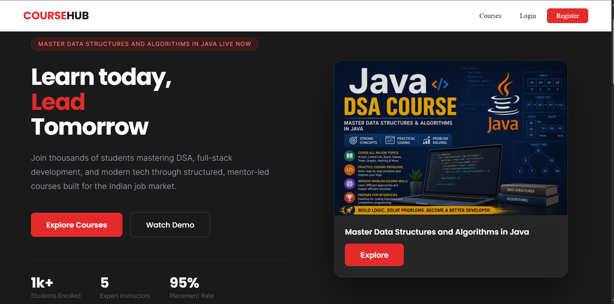
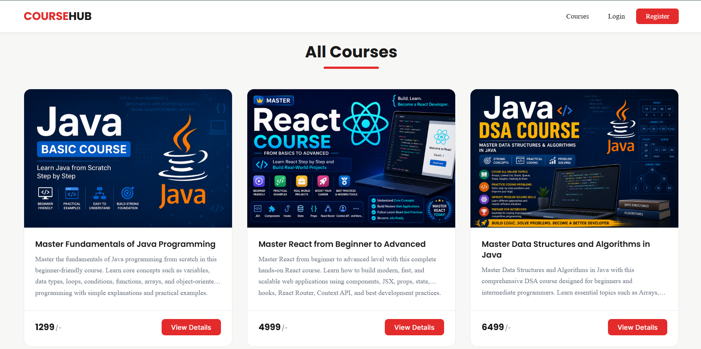

# CourseHub 🎓

> CourseHub is a full stack online course platform where users can browse, purchase and watch video courses. Admins can manage the entire platform from a dedicated dashboard — adding courses, uploading lessons and monitoring purchases.

[](https://coursehub-five.vercel.app/)
[](https://coursehub-5026.onrender.com)

---

## 🌐 Live Demo
🔗 **[https://coursehub-five.vercel.app/](https://coursehub-five.vercel.app/)**

> ⚠️ Backend is hosted on Render free tier — first load may take 30-60 seconds to wake up.

---

## 📸 Screenshots

<!--  -->
<!--  -->
<!--  -->
<!--  -->

*Screenshots coming soon*

---

## 🔑 Demo Credentials

### Admin Account
```
Email:    
Password: 
```

### User Account
```
Email:    
Password: 
```

---

## ✨ Features

### User
- Register & Login with JWT authentication
- Auto login after registration
- Browse all available courses
- Purchase courses
- Access purchased courses in **My Courses**
- Watch video lessons in a dedicated video player
- Send messages via Contact form
- Protected routes — only logged-in users can access purchased content

### Admin
- Dedicated Admin Dashboard
- Create, Edit & Delete courses with thumbnail upload (Cloudinary)
- Add, Edit & Delete lessons with video upload (Cloudinary)
- View all purchase history
- View and manage all contact messages
- Reply to messages via email
- Mark messages as read
- Role-based access control

---

## 🛠️ Tech Stack

### Frontend
| Technology | Usage |
|---|---|
| HTML, CSS, JavaScript | Core web technologies |
| React.js | UI Framework |
| React Router DOM | Client-side routing |
| Axios | API requests |
| Context API | Global state (Auth, Flash, Loading) |
| React Icons | Icons |

### Backend
| Technology | Usage |
|---|---|
| Node.js | Runtime |
| Express.js | Web framework |
| MongoDB | Database |
| Mongoose | ODM |
| JWT | Authentication |
| Bcrypt | Password hashing |
| Multer | File upload handling |
| Cloudinary | Cloud image & video storage |
| Joi | Request validation |

---

## 📁 Folder Structure

```
coursehub-mern/
├── backend/
│   ├── config/          # Cloudinary config
│   ├── controllers/     # Business logic (MVC)
│   ├── middleware/      # Auth, Admin, validation middleware
│   ├── models/          # Mongoose schemas
│   ├── routes/          # Express routes
│   ├── utils/           # Helper functions
│   └── index.js
├── frontend/
│   ├── src/
│   │   ├── api/         # Axios instance
│   │   ├── components/  # Reusable components
│   │   ├── context/     # Auth, Flash, Loading context
│   │   ├── pages/       # All pages
│   │   ├── App.jsx
|   |   └── main.jsx
|   ├── App.css          # Global css    
│   └── index.html
├── screenshots/         # Project screenshots
├── .gitignore
└── README.md
```

---

## ⚙️ Setup & Installation

### Prerequisites
- Node.js
- MongoDB
- Cloudinary account

### 1. Clone the repository
```bash
git clone https://github.com/Abhijit-Patra18/coursehub-mern.git
cd coursehub-mern
```

### 2. Backend Setup
```bash
cd backend
npm install
```

Create `.env` file in `backend/` folder:
```
MONGO_URL=your_mongodb_connection_string
PORT=8080
JWT_SECRET=your_jwt_secret
CLOUDINARY_CLOUD_NAME=your_cloud_name
CLOUDINARY_API_KEY=your_api_key
CLOUDINARY_API_SECRET=your_api_secret
CORS=http://localhost:5173
```

Start backend:
```bash
node index.js
```

### 3. Frontend Setup
```bash
cd frontend
npm install
```

Create `.env` file in `frontend/` folder:
```
VITE_API_URL=http://localhost:8080/api
```

Start frontend:
```bash
npm run dev
```

---

## 🚀 API Routes

### Auth
| Method | Route | Description | Access |
|---|---|---|---|
| POST | `/api/register` | Register user | Public |
| POST | `/api/login` | Login user | Public |

### Courses
| Method | Route | Description | Access |
|---|---|---|---|
| GET | `/api/courses` | Get all courses | Public |
| GET | `/api/courses/:id` | Get single course | Public |
| POST | `/api/courses/new` | Create course | Admin |
| PUT | `/api/courses/:id` | Update course | Admin |
| DELETE | `/api/courses/:id` | Delete course | Admin |

### Lessons
| Method | Route | Description | Access |
|---|---|---|---|
| GET | `/api/lessons/:id` | Get lessons by course | Private |
| POST | `/api/lessons/add` | Add lessons | Admin |
| PUT | `/api/lessons/:id` | Update lesson | Admin |
| DELETE | `/api/lessons/:id` | Delete lesson | Admin |

### Purchase
| Method | Route | Description | Access |
|---|---|---|---|
| POST | `/api/purchase` | Purchase course | Private |
| GET | `/api/mycourses` | Get my courses | Private |
| GET | `/api/purchase/all` | All purchases | Admin |

### Contact
| Method | Route | Description | Access |
|---|---|---|---|
| POST | `/api/contact` | Send message | Public |
| GET | `/api/admin/message` | Get all messages | Admin |
| PUT | `/api/message/update/:id` | Mark as read | Admin |

---

## 👨‍💻 Developer

**Abhijit Patra**
- 🐙 GitHub: [@Abhijit-Patra18](https://github.com/Abhijit-Patra18)
- 💼 LinkedIn: 

---

## 📄 License
This project is open source and available under the [MIT License](LICENSE).

---

*This is a portfolio project built for learning and demonstration purposes only.*
